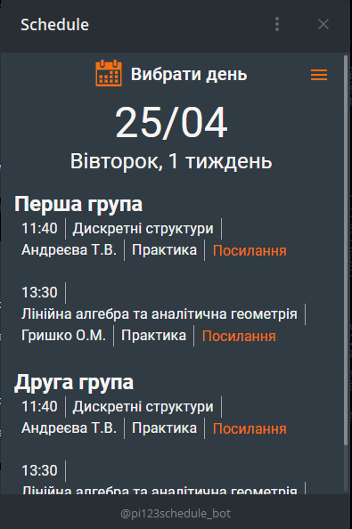
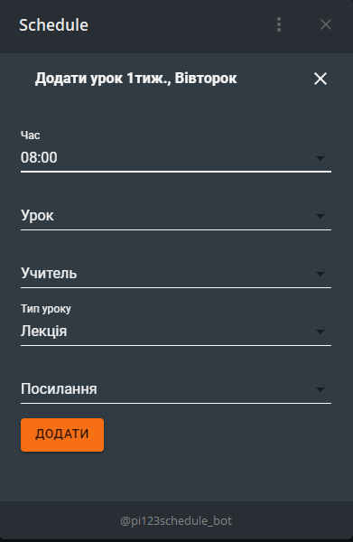
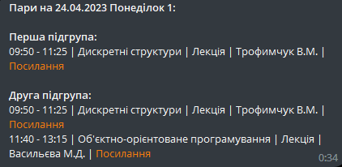

<h1 align="center">Web app schedule</h1>
<p align="center">
  
  
  
</p>

# Technologies
<p>
  <strong>Backend:</strong> Nest, Prisma ORM, MYSQL.<br/>
  <strong>Frontend:</strong> React, Redux Toolkit, Typescript, MUI, React-hook-form
</p>
<h2 align="center"><a  href="https://t.me/pi123schedule_bot">Live Version</a></h2>

# Description
Improved version of 

# Project setup

### Backend:
```
$ git clone https://github.com/MrJeleika/web-app-nest.git
```
Create `.env` file with following variables:
```
DATABASE_URL="Url of your mysql database"
TOKEN="Token of your telegram bot"
```


### Frontend:
```
$ https://github.com/MrJeleika/web-app-telegram-react-mysql.git
```
Replace `baseUrl` in src/redux/api/appApi.ts to url where backend running
